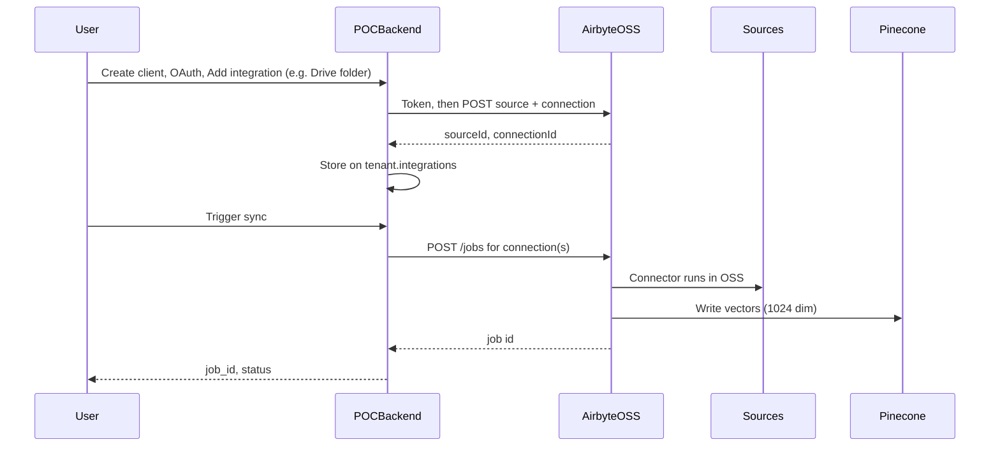

# Plan: Migrate POC to Airbyte OSS (Local Docker)

## Backend requirement (non-negotiable)

**The backend must NOT run any connector logic or perform any data fetching for sync.** It must not:

- Run PyAirbyte or any connector in-process or in Docker.
- Fetch document/content from Google Drive, Notion, or any source.
- Chunk, embed, or upsert to Pinecone as part of sync.

**All sync is done by Airbyte.** The backend only: (1) client CRUD, (2) OAuth and credential storage, (3) Airbyte API calls to create/update sources and connections and to trigger jobs, (4) RAG (query Pinecone + LLM). When using OSS or Cloud, the only path for connect and trigger sync is the Airbyte API. **The PyAirbyte path must be removed or disabled so it is never used in production.**

---

## Context

- **Current POC:** Sync uses PyAirbyte in-process (backend runs the Google Drive connector in Docker, chunks, embeds, upserts to Pinecone). That violates the requirement above.
- **Goal:** Use Airbyte OSS (or Cloud) so connectors run only inside Airbyte; backend uses only the Airbyte API. OSS fixes the Cloud 500 sandbox issue for the Google Drive connector.
- **Extensibility:** Support **multiple integrations per client** (e.g. Google Drive + Notion). Implement **Google Drive only** in the first cut; keep the data model and API extensible for Notion, Google Sheets, etc. later.
- **Deployment:** [Airbyte repo](https://github.com/airbytehq/airbyte) and [deploy docs](https://docs.airbyte.com/quickstart/deploy-airbyte) recommend **abctl** for running OSS locally (clone + docker-compose is deprecated).

---

## Part 1: Run Airbyte OSS Locally

### 1.1 Use abctl (recommended)

1. **Prerequisites:** Docker Desktop installed and running (4+ CPUs, 8GB RAM recommended).
2. **Install abctl:** `curl -LsfS https://get.airbyte.com | bash -` (or Homebrew: `brew tap airbytehq/tap && brew install abctl`).
3. **Install and start Airbyte:** `abctl local install`. UI opens at **http://localhost:8000** (port conflict with FastAPI — see 1.2).
4. **Get credentials:** `abctl local credentials`. In Airbyte UI: **User Settings → Applications → Create an application** to get `client_id` and `client_secret` for API.
5. **Get workspace ID:** From UI or `GET /api/public/v1/workspaces` with the token.

### 1.2 Port conflict

- Airbyte OSS uses port **8000**. Run the POC backend on **8001**: `uvicorn app.main:app --port 8001`. Set `GOOGLE_REDIRECT_URI=http://localhost:8001/oauth/callback-ui` in `.env`.

### 1.3 Admin UI

- **Airbyte OSS UI** is at the same base URL as the API: open **`AIRBYTE_API_URL`** (e.g. `http://localhost:8000`) in a browser. Admins can manage sources, destinations, connections, sync history, and logs there. No extra setup. The app’s `GET /health` returns `airbyte_ui_url` when API mode is enabled so clients know where to open the UI.

### 1.4 Clone (optional)

- Clone [airbytehq/airbyte](https://github.com/airbytehq/airbyte) for reference only. Running OSS is via **abctl**, not docker-compose from the clone.

---

## Part 2: Backend Changes

### 2.1 OSS API path and auth

- **Cloud:** Token at `POST {AIRBYTE_API_URL}/v1/applications/token`; data at `{AIRBYTE_API_URL}/v1/...`.
- **OSS:** Token at `POST <WEBAPP>/api/v1/applications/token`; data at `<WEBAPP>/api/public/v1/...`.

**Implementation:** Add env `AIRBYTE_API_PATH_AUTH` (default `"/v1"`, OSS `"/api/v1"`) and `AIRBYTE_API_PATH_PUBLIC` (default `"/v1"`, OSS `"/api/public/v1"`). In [app/main.py](app/main.py), build token URL and request URLs using these prefixes.

### 2.2 Extensible data model: multiple integrations per client

**Requirement:** A client can have **multiple** Airbyte sources (e.g. Google Drive + Notion). First implementation: **Google Drive only**; design so Notion, Google Sheets, etc. can be added later.

- **Data model:** On each tenant, use a list **integrations** (e.g. `tenant["integrations"]`). Each item: `integration_type` (e.g. `google_drive` | `notion` later), `config` (e.g. `folder_id` for Drive), `airbyte_source_id`, `airbyte_connection_id`, optional `name`.
- **Connector registry:** Map `integration_type` to Airbyte `definitionId` via env (e.g. `AIRBYTE_SOURCE_DEFINITION_ID_GOOGLE_DRIVE`). Config builder per type: `_build_google_drive_source_config(tenant, integration)`; stub for Notion later.
- **API:** `POST /airbyte/integrations` body `{ client_id, integration_type: "google_drive", config: { folder_id } }` to add an integration; list integrations in GET client or dedicated endpoint; trigger sync runs jobs for all connections (or optionally per integration_id).

### 2.3 Create source + connection and trigger job via API only (no PyAirbyte)

**Target behavior (API mode):**

1. **Add integration:** For `integration_type` (first cut: only `google_drive`), build source config; create or update Airbyte source (lookup by name); create or update connection (source → shared Pinecone destination, stream config, namespace = tenant `pinecone_namespace`). Do **not** call `GET /streams`; use fixed stream config `[{"name": "documents", "syncMode": "full_refresh_overwrite"}]` for Drive. Append integration (with source_id, connection_id) to `tenant["integrations"]`.
2. **Trigger sync:** Call Airbyte API `POST /jobs` for the relevant connection(s). **No connector, fetch, chunk, or embed logic in the backend.**

**Implementation:**

- **Helpers** (only when API mode enabled): `_airbyte_get_or_create_destination()` (existing); `_airbyte_create_or_update_source_for_integration(tenant, integration)` using definitionId and config builder; `_airbyte_create_or_update_connection_for_integration(...)` with fixed stream config.
- **Remove or disable PyAirbyte path:** When `AIRBYTE_USE_API=1`, do **not** run PyAirbyte. If trigger-sync is called and no integration has a connection_id, return 400. **Recommendation:** Remove the PyAirbyte code path entirely so the backend never runs connectors.
- **ensure_airbyte_connection(client_id):** In API mode, can be refactored to "add default Google Drive integration" when client has credentials and folder_id (backward compatibility), or UI calls the new "add integration" endpoint.

### 2.4 Mode flag: API-only (OSS/Cloud)

- Env `AIRBYTE_USE_API=1`: backend uses **only** the Airbyte API for connect and trigger sync. No PyAirbyte.

### 2.5 Pinecone destination and embedding dimension

- When creating the Pinecone destination (via API or OSS UI), set **embedding dimension to 1024** to match the existing index. Include in `_airbyte_pinecone_destination_config()` if created from the backend.

### 2.6 Env and docs

- **.env / .env.example:** Document `AIRBYTE_API_URL`, `AIRBYTE_API_PATH_AUTH`, `AIRBYTE_API_PATH_PUBLIC`, `AIRBYTE_USE_API`, `AIRBYTE_WORKSPACE_ID`, `AIRBYTE_SOURCE_DEFINITION_ID_GOOGLE_DRIVE` (and later Notion, etc.).
- **Docs:** Add "Running with Airbyte OSS locally" (abctl, credentials, workspace, port 8001).

---

## Part 3: End-to-end flow (OSS)

---

## Part 4: Implementation order

1. **Port and env:** POC on 8001; add `AIRBYTE_API_PATH_AUTH`, `AIRBYTE_API_PATH_PUBLIC`, `AIRBYTE_USE_API`, connector definition IDs.
2. **URL building:** Update `_airbyte_bearer_token()` and `_airbyte_request()` to use the two path prefixes.
3. **Integrations model:** Add `tenant["integrations"]`; connector registry (definitionId + config builder for `google_drive`); endpoint to add integration (Drive only in first cut).
4. **API flow:** Implement create/update source and connection per integration; ensure_airbyte_connection (or add-integration) creates one integration; trigger sync calls POST /jobs for all (or one).
5. **Remove PyAirbyte:** When API mode on, do not run PyAirbyte; return 400 if no connection. Optionally remove PyAirbyte code path entirely.
6. **Pinecone destination:** Embedding dimension 1024 in destination config.
7. **Docs and .env.example:** OSS setup and env vars.

---

## Summary

| Item | Action |
|------|--------|
| Backend | **Zero** connector/fetch logic; only Airbyte API. Remove or disable PyAirbyte for production. |
| Extensibility | Multiple integrations per client; list + config per type; connector registry (definitionId + config builder). Drive first; Notion/Sheets later. |
| Run OSS | **abctl** (install + `abctl local install`). |
| Port | POC backend on 8001; Airbyte on 8000. |
| API paths | `AIRBYTE_API_PATH_AUTH`, `AIRBYTE_API_PATH_PUBLIC` for OSS (`/api/v1`, `/api/public/v1`). |
| Connect | Add integration via API (type + config); create source + connection in Airbyte; store in tenant.integrations. |
| Trigger sync | POST /jobs for connection(s); no in-app connector run. |
| Pinecone | Embedding dimension 1024 in destination config. |
| Admin UI | Open `AIRBYTE_API_URL` in browser (e.g. http://localhost:8000); `/health` returns `airbyte_ui_url` when API mode on. |
